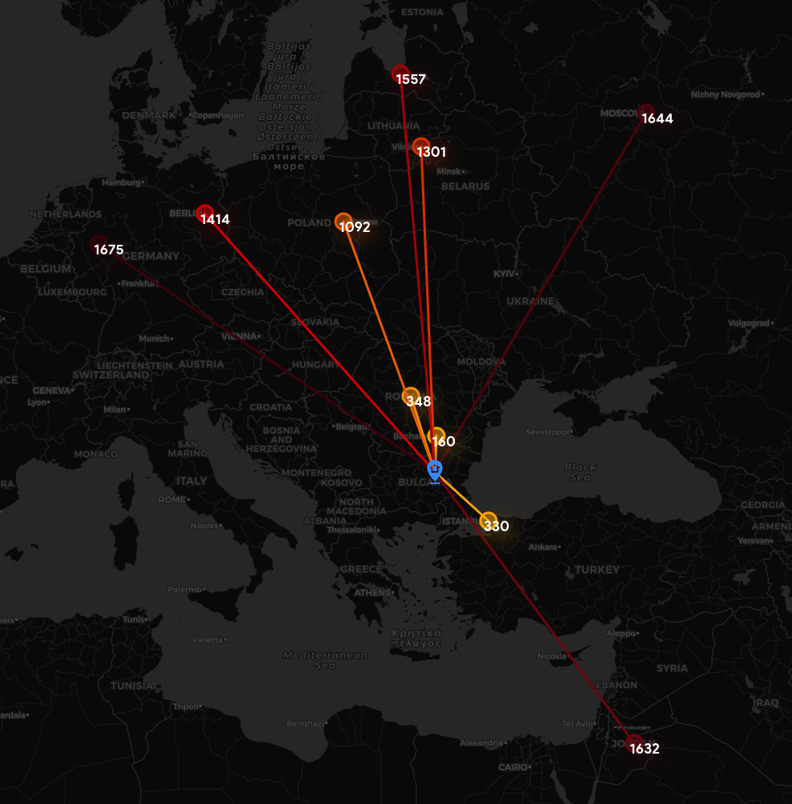

# :movie_camera: NearbyMovies
A module for creating a web-map with movies.
Enter a year :calendar: and a location :round_pushpin:, and you will receive a .html file with **10 nearest movies** to your location.
***
**:book:Example**:
```commandline
>>> Please enter a year you would like to have a map for:2012
>>> Please enter your location (format: lat, long):56,98
>>> Movie data read.
>>> Selected 55 movies/shows filmed in 2012.
>>> 10 nearest movies found.
```
<p align="center">
  
</p>

With the map *(templates/map.html)*, you will be able to see the distances to your location in kilometres and movie names.
***
**:scroll: HTML description**
<br>
- `<!DOCTYPE html>` - stating filetype <br>
- `<head></head>` - a tag for metadata(links to css/js files)
- `<link rel="stylesheet" href="">` - a link to .css files for styling the page
- `<script src=""></script> `- a link to .js files
- `<body></body> `- defines a document's body, where the main elements are
- `<div></div>` - a container for elements
- `<style></style> `- a tag for writing css inside of html, a tag for styling the file

